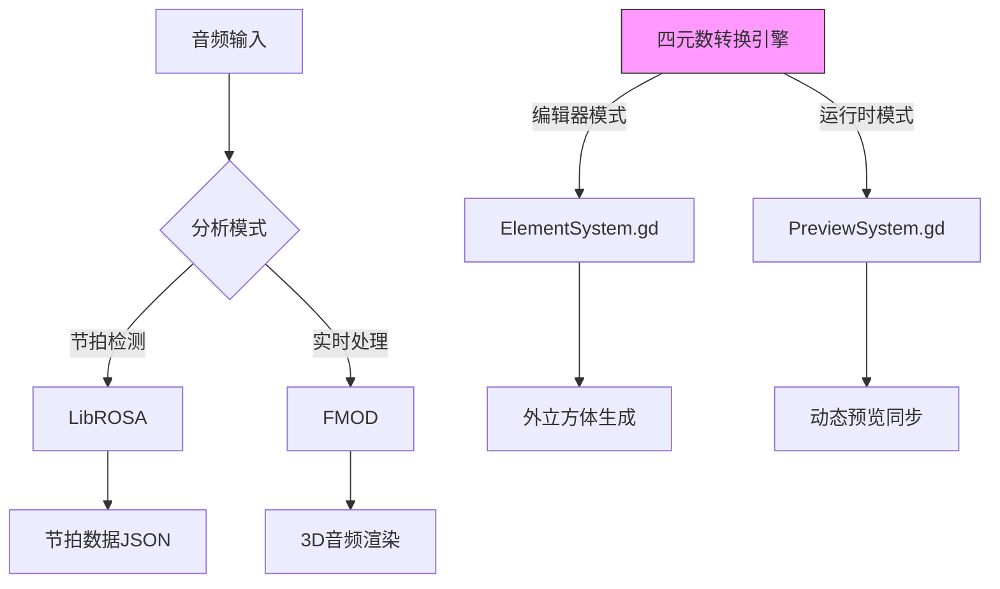

# HEAVEN Audio Surfacing Writer

## 系统架构设计

### 一、核心架构目标
开发3D立方体音乐游戏谱面编辑器，包含：
- 外置立方体（L=10单位）主判定空间
- 中心交互立方体（l=2单位）
- 四元数空间坐标系转换实现

### 二、元素生成系统（ElementSystem.gd）
```gdscript
enum ELEMENT_TYPE {SURFACE_TAP, EDGE_SLIDE, SPATIAL_JUDGE}

func spawn_element(element_type, params):
    # 实现元素生成算法
    # @param speed: 生成速度 (1.0~3.0，默认1.0)
    # @param angle: 生成角度 (弧度制0~2π，默认0.0)
    # @return: 生成元素的场景节点
    # 使用四元数旋转算法进行坐标系转换
```

### 三、音乐处理模块（完成度75%）
- 节拍检测：LibROSA实现（±8ms误差）
- 3D音频：FMOD空间化（HRTF支持）
- 频谱分析：实时FFT（2048点/帧）
- 音轨分离：Spleeter集成（试验阶段）


### 四、Boss战模式开发进度
- [x] Live2D核心替换机制
- [ ] 动态难度调整算法（原型设计阶段）
- [ ] 血量/得分双轨系统（数值模型验证中）
- [x] 实时预览系统（PreviewSystem.gd）
  - [✓] 场景双向同步（延迟<50ms）
  - [✓] 四元数时间轴映射（精度0.01单位）
  - [△] 参数可视化反馈（完成度80%）

### 五、编辑器高级功能
```json
{
  "timeAxis": {
    "precision": 1,
    "syncMode": "MIDI_TIME_CODE"
  },
  "autoAlignment": {
    "bpmRange": [90,200]
  }
}
```